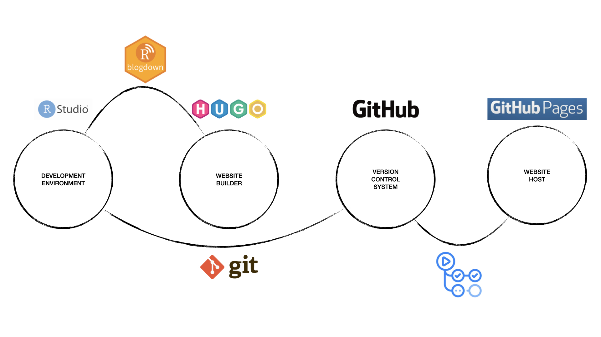

```{r setup, include=FALSE}
knitr::opts_chunk$set(collapse = TRUE)
```
# tl;dr
It might be a good weekend's work, but it is fun, so *do it!* as
[Shia LaBeouf](https://www.youtube.com/watch?v=ZXsQAXx_ao0/) famously said...

# Why start a blog in the first place?
Looking at the ever-growing number of blogs dedicated to topics like data
science and R, it might seem pointless to some to jump on the bandwagon and set
up their own. This might also be amplified by a feeling of not yet being
good enough or the more general question of what to contribute to the incredible
amount of available information on R, data science, and basically everything
around them. (Those who might not understand this feeling, just observe a day or
week on [R-Bloggers](https://r-bloggers.com/), and you will know what
I mean…)
This feeling has kept me from starting a blog for quite some time. Still, I
finally found my answer: R and data science are fast-changing phenomena, and you
might be (or even just feel like you are) on top of the game regarding whatever
you did that day, week, or month, so why not report it and potentially help
others? After reading myriads of blog posts over the years, I feel this drives
most people with the most incredible blogs. Additionally, it is a
phenomenal opportunity to learn new and grow existing skills on the way as
there is probably no better way to consolidate what you just learned. Lastly,
those who know they might be looking for a new job soon can proactively shape
what recruiters and future employers are likely to find when they get looked up
on the internet – which can be expected to happen. So, if you are like me and
have already regularly played with the idea of setting up a blog for yourself,
just go ahead and *do it* the next time you have a day or two’s work to invest!
Hopefully, the following paragraphs and blogposts will be somewhat helpful in
this regard.

# So, how did I do it?
After careful consideration, I finally decided to *just do it* that upcoming
weekend and this was when the fun began. As an R user by faith, I had no choice
but to use the [blogdown]( https://github.com/rstudio/blogdown/) package and
[Hugo]( https://gohugo.io/), an open-source website generator framework that is
advertized as relatively easy to use, even for people like me who never
seriously touched the typical web stack
([HTML, CSS, JavaScript](https://developer.mozilla.org/en-US/docs/Learn/))
before. You could use website builders like
[WordPress]( https://wordpress.com/en/) as well, but blogdown makes it maximally
easy to create a website like this in R using RMarkdown files as the individual
pages and for posts.
These can then be rendered into HTML files that are incorporated into a Hugo
theme which defines the website's overall look and is selected by the user.
All of this with R-functions from the blogdown-package.
This is actually *pretty easy* when you don’t go too crazy regarding
modifications.
There is lots of excellent documentation on how to do all this using the already
classic [Academic Theme]( https://github.com/wowchemy/starter-hugo-academic/),
e.g., in this [Academic Theme Demo Site]( https://academic-demo.netlify.app/).
But as for me, I wanted to have a more minimalist look which led me to use the
[KeepIt](https://themes.gohugo.io/themes/keepit/) theme: Here, things get a
bit more interesting when using blogdown. Essentially, everything is the same, but
as stated in the documentation of *KeepIt*, you must render the site in a
production environment and I could not find out how to do this using R-functions, which
added the minor inconvenience of having to use a BASH command additionally
each time I update the site (e.g., when writing a new blog post).
Nevertheless, I am pretty happy that I chose KeepIt because I like the site’s
looks and felt the minimalist approach might have helped me navigate the included
files when I tried to modify the theme, e.g., when swapping the username for my
little cartoon character in the upper-left corner. Still, the choice is yours and
there are many pretty cool [themes](https://themes.gohugo.io/) available.

The figure below shows a rough overview on what technologies are utilized when
setting up a blog like this using blogdown and GitHub Pages.



# What have I learned by setting up this website?
As somebody interested in R and in the emerging world of Shiny apps, basic
knowledge of web development is a must-have, and all the time I spent hands-on
in the HTML, CSS, and JavaScript files really got me kickstarted with a lot of
things that I was wanting to learn in the future anyway.
This is a big plus but there is so much more you learn like using GitHub
Pages, GitHub Actions, and possibly some basic usage of your Terminal if you did
not use it before. So, stay tuned as I will prepare detailed step-by-step posts
on all the individual steps necessary to set up a blog like this using Hugo,
blogdown, and GitHub Pages! 
